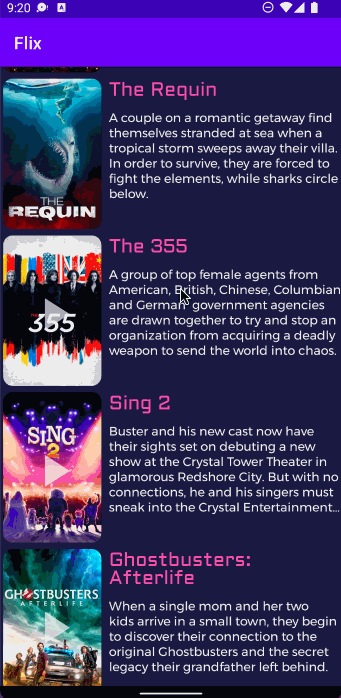

# Project 2 - *Flix*

**Flix** is an android app that shows the top 20 movies playing from TMDB
Submitted by: **John Sena Akoto**

Time spent: **3** hours spent in total

## User Stories

The following **required** functionality is completed:

* [x] App can **request and parse movie data from TMDB API**
* [x] User can **display a RecyclerView of the top 20 movies**

The following **optional** features are implemented:

* [x] User can **switch between portrait and landscape orientation**

The following **additional** features are implemented:

* [x] Nice UI additions

## Video Walkthrough

Here's a walkthrough of implemented user stories:

GIF created with [LiceCap](http://www.cockos.com/licecap/).

## Notes

Describe any challenges encountered while building the app.
I had to clean project everytime before running AVD

## License

    Copyright [yyyy] [name of copyright owner]

    Licensed under the Apache License, Version 2.0 (the "License");
    you may not use this file except in compliance with the License.
    You may obtain a copy of the License at

        http://www.apache.org/licenses/LICENSE-2.0

    Unless required by applicable law or agreed to in writing, software
    distributed under the License is distributed on an "AS IS" BASIS,
    WITHOUT WARRANTIES OR CONDITIONS OF ANY KIND, either express or implied.
    See the License for the specific language governing permissions and
    limitations under the License.
